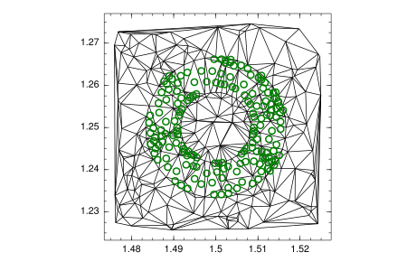

# User guide

## Introduction
This package provides constrained Delaunay-Triangulations. It implements an edge-flipping algorithm to restore the Delaunay property and to remove intersecting edges. The user can define constraints as closed polygons and the package automatically marks faces interior to constrained regions.  The package provides various convenience methods, such as exporting triangulations as FEM-meshes or computing the centroid of faces.

## Unconstrained triangulations
The first step is to create an empty mesh and set an appropriate bound box. `DelaunayMeshes` internally scales all vertex coordinates to fit into an enclosing virtual triangle. The bounding box establishes this scaling. Note that all vertices that are pushed into the triangulation later on must fit into this bounding box.

```Julia
import DelaunayMeshes

# create empty mesh and set bounding box
mesh = DelaunayMeshes.Mesh()
DelaunayMeshes.setboundingbox(mesh, [-15.0, 15.0, -15.0, 15.0])
```

Vertices are added to the triangulation by pushing vectors of coordinates.

```Julia
seed = rand(UInt32)
nvertices = 200
points = rand(Float64, nvertices, 2)*30. - 15.
push!(mesh, points)  
```

We can plot the triangulation using `getdelaunaycoordinates`

```Julia
import Winston
xc, yc = DelaunayMeshes.getdelaunaycoordinates(mesh.tesselation)
p = Winston.FramedPlot(aspect_ratio=1)
Winston.add(p, Winston.Curve(xc, yc))
```


Note that, internally, `DelaunayMeshes` scales down all coordinates into a numerically favorable range. The method `unscalepoints` allows to recover the original coordinates:

```Julia
unscaledpoints = DelaunayMeshes.unscalepoints(mesh, [xc'; yc']')
```

## Constraints
Constraints can be added to unconstrained triangulations using `addconstraint`
```Julia
# create an unconstrained triangulation
mesh = DelaunayMeshes.Mesh()
DelaunayMeshes.setboundingbox(mesh, [-15.0, 15.0, -15.0, 15.0])
seed = rand(UInt32)
nvertices = 200
points = rand(Float64, nvertices, 2)*30. - 15.
push!(mesh, points)  

# push vertices for two concentric circles
nringvertices = 40
θ = linspace(0., 2.*π, nringvertices + 1)[1:end-1]
rinner = 5.
router = 10.
innerRing = rinner * [cos(θ'); sin(θ')]'
outerRing = router * [cos(θ'); sin(θ')]'
push!(mesh, innerRing)
push!(mesh, outerRing)

# add constraints
innerConstraintVertexList = [x for x in (nvertices+3+nringvertices):-1:(nvertices+3+1)]
outerConstraintVertexList = [x for x in (nvertices+3+nringvertices+1):(nvertices + 3 + 2*nringvertices)]
DelaunayMeshes.addconstraint!(mesh, innerConstraintVertexList)
DelaunayMeshes.addconstraint!(mesh, outerConstraintVertexList)
```

All faces that are located to the right of the enclosing polygon are marked as being exterior to the triangulated region. The current status of a face is stored in `Mesh.faceLocation`. We can use it, for example, to plot all Voronoi vertices that are interior to the region:

```Julia
# get Delaunay edges and Voronoi vertices
xc, yc = DelaunayMeshes.getdelaunaycoordinates(mesh.tesselation)
vorVert = DelaunayMeshes.getvoronoivertices(mesh)

# plot all edges and all interior Voronoi vertices
import Winston
p = Winston.FramedPlot(aspect_ratio=1)
Winston.add(p, Winston.Curve(xc, yc))
Winston.add(p, Winston.Points( vorVert[mesh.faceLocation,1], vorVert[mesh.faceLocation,2], kind="circle", color="green"))
```



## Quad-Edge data structure
Internally, `DelaunayMeshes` uses a quad-edge data structure to maintain the triangulation. Edges have triangulation vertices as sources while the source of a dual edge is a face. All basic quad-edge operations are provided and can be used to match the face index to a triangle (and vice versa). The user may consult the API documentation for details.
